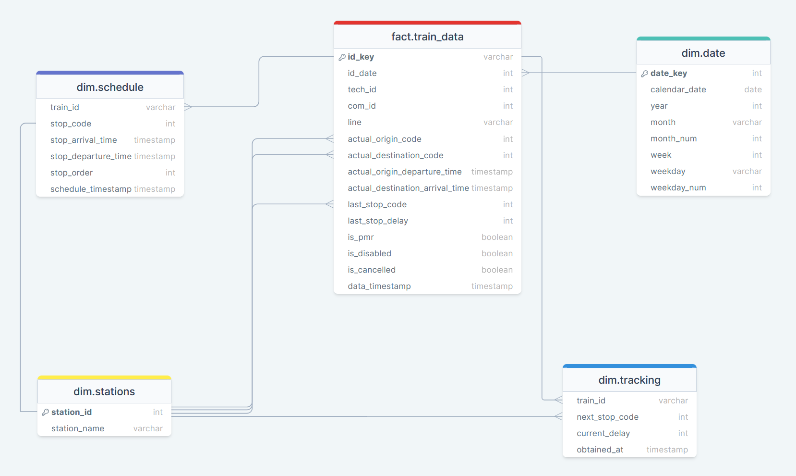

The data that will be used for this preliminary analysis contains relevant information about Catalan railway system operation, such as train schedules or tracking data about commuter and regional trains run by RENFE in Catalonia. Therefore, this data excludes high-speed trains and other railway service providers like FGC.

The present data have been previously scraped automatically employing a self-written R script and deployed and automated using GitHub's CLI service GitHub Actions. In a first stage, the data has been stored in a cloud-based PostgreSQL database. After that, the scraped data has been preprocessed to make it suitable for the final data model and stored in a local PostgreSQL relational database.

## Executive summary

-   In the analyzed period, 53% of the trains arrived late at their destinations. However, this figure hides substantial differences between commuter (55.9%) and regional trains (31.9%).

-   Most unpunctual trains experienced minor to moderate delays, just slightly over the threshold to be considered unpunctual. Given that, small improvements to the railway service or its infrastructure could potentially yield major improvements in punctuality metrics.

-   Most delays are observed between rush hours, mainly on weekdays, suggesting that a large part of them could be caused by small dysfunctions causing multiplicative effects on a congested infrastructure.

-   Trains with lower journey times and/or fewer stops experience fewer delays and better punctuality metrics. Given that, shorter services with coordinated or cadenced schedules could be a better approach, especially for those lines covering greater distances.

## Database structure

As seen below, the database that will be used contains 5 relational tables conforming a star schema. These tables include basic train data, schedule and tracking data for every scraped train as well as complementary information contained in stations and date tables. Train data table includes, among others:



-   **id_key**: composed unique key for every scraped train, obtained by concatenating the date_key value and the technical and commercial train ids.

-   **line**: train service line.

-   **actual_origin_code** and **actual_destination_code**: train departure station and train final station numeric codes.

-   **actual_origin_departure_time** and **actual_destination_arrival_time**: real departure/arrival time at origin and destination station.

-   **last_stop_code**: last station where the train have stopped, usually the last scheduled stop or null (in both cases meaning that train have arrived at the scheduled destination station)

-   **last_stop_delay**: train delay at destination or, otherwise, at the last station where it has stopped.

-   **is_pmr**: train accessibility for people with mobility issues. If true train have features to allow easy on-boarding (train floor at platform level and/or ramps)

-   **is_disabled**: if true train have been cancelled.

-   **is_cancelled**: on practice indistinguishable from is_disabled. If true, train has been cancelled.

-   **data_timestamp**: date and hour indicating when the data was scraped (CEST time).

Train schedule table includes:

-   **stop_code**: station code for every station where a given train stops.

-   **stop_arrival_time** and **stop_departure_time**: arrival and departure time for every scheduled stop.

-   **stop_order**: given order in which train stops on every station, according to schedule.

-   **schedule_timestamp**: date and hour indicating when the schedule data was scraped (CEST time).

Tracking data includes:

-   **next_stop_code**: next scheduled stop at the moment when tracking data was scraped, indicating that the train is going to a given station or already arrived but it hasn't departed from.

-   **current_delay**: estimated train delay in minutes at the scraping time and according the scheduled time for the next scheduled stop. Can take positive (train is delayed) or negative values (train going ahead of schedule).

-   **obtained_at**:date and hour indicating when the tracking data was obtained (CEST time).

## Exploratory data analysis with SQL

Although there are other companies providing railway services in Catalonia, Renfe is undoubtedly the largest. This public company, held by the Spanish state, operates in Catalonia a rail network that extends for more than 460 km, covering the densely populated Barcelona area (4.5M inhabitants) as well as other significant cities and towns and part of the Catalan countryside. Given that some rides end at 'Cervera de la Marenda' and 'La Tor de Querol' stations, in French territory, RENFE trains also provide valuable international connections with the French commuter and regional trains run by its homologue SNCF.

For years Renfe's service, which serves about 350,000 daily rides on weekdays, has been refered to be very poor, unpunctual, and unreliable. The lack of public investment by the central Spanish government has usually been pointed out as the main reason for these deficiencies.

To test these feelings about Renfe's service in Catalonia I will take a first glance at the scraped data. More precisely, the data that I will be analysing here takes into account the first 75 days of available data, from mid-August to the end of October 2022. For this preliminary analysis, I will be using PostgreSQL syntax to query data directly from the database. Later, in a more advanced stage, I will use R language for data cleaning and provide a more in-depth analysis.

### Connecting to local database

```{r, message = FALSE, warning=FALSE}
# Libraries
require(RPostgres)
require(DT)
require(tidyverse)

# PostgreSQL local database connection
con <- dbConnect(RPostgres::Postgres(), 
                 dbname = "traindb", 
                 host = "localhost", 
                 port = "5432", 
                 user = Sys.getenv("TRAIN_LOCALDB_USER"), 
                 password = Sys.getenv("TRAIN_LOCALPWD"))

```

### A first dive into the data

To start with, I'll be creating a temporary table called 'basic_data' to hold all those basic variables I'll be looking in all along the analysis. Therefore, some joins between tables will be needed. For now, I'll only be using train_data table along with the two tables holding date and stations data. As schedule and tracking tables will need a more in depth review and cleaning to be truly useful, I'll let those for a later, more in depth EDA with R.

This said, in this first stage I'll be adding three new measures using the existing data:

-   **service_type**, which according to which train line a train is assigned will classify them as 'Commuter' or 'Regional'.

-   **is_delay**, which taking the observed delay at the end of the journey and the service type will assign a boolean true/false value. More than 3 minutes delay at destination is considered the threshold for commuter trains, which goes up to 5 minutes for regional trains. The criterion used to establish which trains are effectively considered delayed or not is the same as that used by Renfe [[See here](https://rodalies.gencat.cat/ca/sobre-rodalies/que-son-rodalies-de-catalunya/index.html)]

-   **is_cancelled**, recoded measure as it's distinguishable from is_disabled. When is_disabled is true, is_cancelled also turns true to make the analysis easier.

```{sql, connection = "con"}
WITH service_type_cte AS (
  SELECT
    id_key,
    CASE 
      WHEN line IN ('R1', 'R2', 'R3', 'R4', 'R7', 'R8', 'RG1', 'RT2') THEN 'Commuter'
      ELSE 'Regional'
    END AS service_type
	FROM train_data
)
SELECT
	id_key,
	id_date,
	line,
	service_type,
	tech_id, 
	com_id,
	actual_origin_departure_time,
	actual_destination_arrival_time,
	last_stop_code,
	INITCAP(station_name) AS last_stop_name,
	last_stop_delay,
	CASE 
		WHEN last_stop_delay > 3 AND service_type = 'Commuter' THEN true
		WHEN last_stop_delay > 5 AND service_type = 'Regional' THEN true 
		ELSE false
	END AS is_delay,
	CASE 
	  WHEN is_disabled = false AND is_cancelled = false THEN false
	  ELSE true
	END AS is_cancelled,
	is_pmr,
	data_timestamp,
	calendar_date,
	month,
	week
INTO basic_data
FROM train_data 
  LEFT JOIN service_type_cte 
    USING(id_key)
  LEFT JOIN stations 
    ON train_data.last_stop_code = stations.station_id
  LEFT JOIN date
    ON train_data.id_date = date.date_key
WHERE data_timestamp <= '2022-10-30 23:59:00';
```

This done, I've queried this table to obtain some basic general statistics on the data. As there seems to be negative delays at destination, some of them extreme and improbable (up to -1440 minutes), I also have calculated an extra measure named 'adjusted_delay' to verify the impact of this outliers over the data, as it can be seen below.

```{sql, connection = "con"}
WITH adjusted_delay_cte AS (
SELECT
  id_key,
  CASE 
    WHEN last_stop_delay < 0 THEN 0
    ELSE last_stop_delay
  END AS adjusted_delay
FROM basic_data)
SELECT
  service_type,
  COUNT(id_key) AS total_trains,
  MIN(last_stop_delay) AS min_delay,
  MAX(last_stop_delay) AS max_delay,
  ROUND(AVG(last_stop_delay), 1) AS avg_delay,
  ROUND(AVG(adjusted_delay), 1) AS avg_delay_adj,
  PERCENTILE_CONT(0.5) WITHIN GROUP (ORDER BY last_stop_delay) AS median_delay,
  ROUND(AVG(is_delay::INT) * 100, 1) AS pct_delayed,
  ROUND(AVG(is_cancelled::INT) * 100, 1) AS pct_cancelled,
  ROUND(AVG(is_pmr::INT) * 100, 1) AS pct_pmr
INTO general_stats
FROM basic_data
  LEFT JOIN adjusted_delay_cte USING(id_key)
  GROUP BY service_type;
```

As shown in the table, we seem to have almost 60,000 registries and some strange values when it comes to the lowest delays at the destination, something that should be revised on a later in-depth data cleaning.

From the calculated measures it's possible to infer that:

-   Commuter trains tend to be more unpunctual in percentage, as 55.9% of them did not arrive on time at their destination, as opposed to 31.9% for regional trains. Additionally, commuter trains are more likely to be cancelled, even though the percentage of cancelled trains is very low.

-   Especially among commuter trains, and according to the median delay, its delay at the destination tends to be very close to the threshold to classify them as delayed at the destination. So most of those commuter trains classified as delayed are probably just slightly exceeding this threshold.

-   When it comes to the delay (in minutes) it doesn't seem to be big differences, as average and median delays are similar for commuter and regional trains.

-   Even though the abnormally low delay at destination appears to have some impact on aggregated data, the impact is minimal and therefore not very concerning at this stage.

-   Finally, most commuter trains (78.8%) are labelled as accessible for people with mobility issues, while only 30.5% regional trains are.

```{r, echo= FALSE}
tbl_1_general_stats <- dbGetQuery(con, "SELECT * FROM general_stats")

tbl_1_general_stats %>% 
  datatable(caption = "Table 1. Main indicators, split by service type",
            rownames = FALSE, 
            options = list(dom = 't'), 
            colnames=c("Service type", 
                       "Total trains", 
                       "Min delay", 
                       "Max delay", 
                       "Avg delay", 
                       "Avg adjusted delay",
                       "Median delay", 
                       "Pct delayed", 
                       "Pct cancelled", 
                       "Pct accessible"))
```

### Delays distribution

When looking at delays distribution is it possible to verify that most of these are minor delays, that is, that didn't arrive more than 5 minutes late at their destination. This way and according to this data, most commuter trains were punctual (19.6%) or experienced minor delays (37.5%), while about 23% of them experienced significant (11-15 minutes) or heavy delays (more than 15 minutes).

```{sql, connection = "con"}
WITH delay_category_cte AS (
SELECT
  id_key,
   CASE 
    WHEN last_stop_delay <= 0 THEN '1- Punctual'
    WHEN last_stop_delay BETWEEN 1 AND 5 THEN '2- From 1 to 5 minutes'
    WHEN last_stop_delay BETWEEN 6 AND 10 THEN '3- From 6 to 10 minutes'
    WHEN last_stop_delay BETWEEN 11 AND 15 THEN '4- From 11 to 15 minutes'
    ELSE '5- More than 15 minutes'
  END AS delay_category
FROM basic_data
)
SELECT
  delay_category,
  ROUND(COUNT(delay_category) / (( SUM(COUNT(*)) OVER() )) * 100, 1) AS pct_count,
  ROUND(AVG(is_cancelled::INT) * 100, 1) AS pct_cancelled
INTO delay_distribution_commuter
FROM basic_data
 LEFT JOIN delay_category_cte
  USING(id_key)
WHERE service_type = 'Commuter'
GROUP BY delay_category
ORDER BY delay_category;
```

```{r, echo= FALSE}
tbl_2_delay_distribution_commuter <- dbGetQuery(con, "SELECT * FROM delay_distribution_commuter")

tbl_2_delay_distribution_commuter %>% 
  datatable(caption = "Table 2. Commuter trains: Main indicators by delay category.",
            rownames = FALSE, 
            options = list(dom = 't'))
```

```{sql, connection = "con"}
WITH delay_category_cte AS (
SELECT
  id_key,
  CASE 
    WHEN last_stop_delay <= 0 THEN '1- Punctual'
    WHEN last_stop_delay BETWEEN 1 AND 5 THEN '2- From 1 to 5 minutes'
    WHEN last_stop_delay BETWEEN 6 AND 10 THEN '3- From 6 to 10 minutes'
    WHEN last_stop_delay BETWEEN 11 AND 15 THEN '4- From 11 to 15 minutes'
    ELSE '5- More than 15 minutes'
  END AS delay_category
FROM basic_data
)
SELECT
  delay_category,
  ROUND(COUNT(delay_category) / (( SUM(COUNT(*)) OVER() )) * 100, 1) AS pct_count,
  ROUND(AVG(is_cancelled::INT) * 100, 1) AS pct_cancelled
INTO delay_distribution_regional
FROM basic_data
 LEFT JOIN delay_category_cte
  USING(id_key)
WHERE service_type = 'Regional'
GROUP BY delay_category
ORDER BY delay_category;
```

The same can be said about regional trains, which generally perform slightly better. This way 68.1% of them are completely punctual, or they just suffered from minor delays, over the 16.1% of them that experienced significant or heavy delays at destination.

In addition, it is worth noting that most cancelled trains fall under the punctual category, regardless of whether they are classified as commuter trains or regional trains. This probably means that most cancelled trains did not even depart from the origin station.

```{r, echo= FALSE}
tbl_3_delay_distribution_regional <- dbGetQuery(con, "SELECT * FROM delay_distribution_regional")

tbl_3_delay_distribution_regional %>% 
  datatable(caption = "Table 3. Regional trains: Main indicators by delay category.",
            rownames = FALSE, 
            options = list(dom = 't'))
```

### Main metrics by time periods

#### Trend by week

Looking at the trend by week over the chosen metrics is it hard to spot any clear trend, despite it can be perceived a slight reduction on average delay at destination and on the percentage of delayed trains, both for commuter and regional trains.

```{sql, connection = "con"}
SELECT
  month,
  week,
  COUNT(id_key) AS total_trains,
  MIN(last_stop_delay) AS min_delay,
  MAX(last_stop_delay) AS max_delay,
  ROUND(AVG(last_stop_delay), 1) AS avg_delay,
  PERCENTILE_CONT(0.5) WITHIN GROUP (ORDER BY last_stop_delay) AS median_delay,
  ROUND(AVG(is_delay::INT) * 100, 1) AS pct_delayed,
  ROUND(AVG(is_cancelled::INT) * 100, 1) AS pct_cancelled
INTO general_stats_evolution_commuter
FROM basic_data
WHERE service_type = 'Commuter'
GROUP BY month, week
ORDER BY week;
```

```{r, echo= FALSE}
tbl_4_general_stats_ev_com <- dbGetQuery(con, "SELECT * FROM general_stats_evolution_commuter")

tbl_4_general_stats_ev_com %>% 
  datatable(caption = "Table 4. Commuter trains: Main indicators evolution.",
            rownames = FALSE,
            colnames=c("Month",
                        "Week",
                        "Total trains",
                        "Min delay",
                        "Max delay",
                        "Avg delay",
                        "Median delay",
                        "Pct delayed",
                        "Pct cancelled"))
```

```{sql, connection = "con"}
SELECT
  month,
  week,
  COUNT(id_key) AS total_trains,
  MIN(last_stop_delay) AS min_delay,
  MAX(last_stop_delay) AS max_delay,
  ROUND(AVG(last_stop_delay), 1) AS avg_delay,
  PERCENTILE_CONT(0.5) WITHIN GROUP (ORDER BY last_stop_delay) AS median_delay,
  ROUND(AVG(is_delay::INT) * 100, 1) AS pct_delayed,
  ROUND(AVG(is_cancelled::INT) * 100, 1) AS pct_cancelled
INTO general_stats_evolution_regional
FROM basic_data
WHERE service_type = 'Regional'
GROUP BY month, week
ORDER BY week;
```

```{r, echo= FALSE}
tbl_5_general_stats_ev_reg <- dbGetQuery(con, "SELECT * FROM general_stats_evolution_regional")

tbl_5_general_stats_ev_reg %>% 
  datatable(caption = "Table 5. Regional trains: Main indicators evolution.",
            rownames = FALSE,
            colnames=c("Month",
                        "Week",
                        "Total trains",
                        "Min delay",
                        "Max delay",
                        "Avg delay",
                        "Median delay",
                        "Pct delayed",
                        "Pct cancelled"))
```

#### Trend by day of the week

Instead, when aggregating the data by day of the week, we see that trains that operate on weekdays tend to experience fewer delays. As shown in the table below, about 54-58% of the trains running on weekdays arrive late at their destination, compared to 37-41% of trains running on the weekend. This fact could be correlated with the traffic reduction that the railway network experiences on weekends, as also shown in the table.

```{sql, connection = "con"}
SELECT 
  weekday,
  COUNT(*) AS total_trains,
  ROUND(AVG(last_stop_delay), 1) AS avg_delay,
  PERCENTILE_CONT(0.5) WITHIN GROUP (ORDER BY last_stop_delay) AS median_delay,   
  ROUND(AVG(is_delay::INT) * 100, 1) AS pct_delayed,
  ROUND(AVG(is_cancelled::INT) * 100, 1) AS pct_cancelled
FROM basic_data
  LEFT JOIN date
    ON basic_data.id_date = date.date_key
GROUP BY weekday
ORDER BY pct_delayed DESC;
```

#### Trend by hour of the day

In the same way, when analysing the data by hour of the day, grouped by trains departure hour from the origin, it can be spotted how delays are higher during rush hours, when most trains are running, especially between 7am-9am and 6pm-8pm.

```{sql, connection = "con"}
SELECT 
  EXTRACT(hour from actual_origin_departure_time) AS day_hour,
  COUNT(*) AS total_trains,
  ROUND(AVG(last_stop_delay), 1) AS avg_delay,
  PERCENTILE_CONT(0.5) WITHIN GROUP (ORDER BY last_stop_delay) AS median_delay,
  ROUND(AVG(is_delay::INT) * 100, 1) AS pct_delayed,
  ROUND(AVG(is_cancelled::INT) * 100, 1) AS pct_cancelled
INTO stats_by_hour
FROM basic_data
GROUP BY day_hour
ORDER BY day_hour;
```

```{r, echo=FALSE}
tbl_5_stats_by_hour <- dbGetQuery(con, "SELECT * FROM stats_by_hour")

tbl_5_stats_by_hour %>% 
  datatable(caption = "Table 6. Delay metrics by train line",
            rownames = FALSE,
            colnames=c("Day hour",
                       "Total trains",
                       "Avg delay",
                       "Median delay",
                       "Pct delayed",
                       "Pct cancelled"))
```

### Main metrics by train line

Focussing on the differences between train lines, it can be seen how commuter lines under-perform their regional peers on punctuality metrics. This way, of the 10 worst-performing lines, 8 are commuter lines. Moreover, only one commuter train (R2 line), but also the most important one by the number of trains, has less than 50% of their trains running late at their destination.

A deeper look at the data reveals an interesting fact: most best-performing regional lines, like the R16 and R14 lines, goes totally or partially by the so-called south corridor, which connects Barcelona with southern and west Catalonia. In fact, the R2 line, which was the best-performing commuter line, also partially runs through this corridor, while their northern counterparts tend to experience more delays.

```{sql, connection = "con"}
SELECT
	line,
	service_type,
	COUNT(line) AS total_trains, 
	ROUND((AVG(is_delay::INT) * 100), 1) AS pct_delayed
INTO stats_by_line
FROM basic_data
	GROUP BY line, service_type
	ORDER BY pct_delayed DESC;
```

```{r, echo=FALSE}
tbl_6_line_stats <- dbGetQuery(con, "SELECT * FROM stats_by_line")

tbl_6_line_stats %>% 
  datatable(caption = "Table 7. Delay metrics by train line",
            rownames = FALSE,
            colnames=c("Line",
                       "Service type",
                       "Total trains",
                       "Pct delayed"))
```

### Delay by journey time

As shown below, when calculating the journey time it's possible to observe some anomalous data, from extremely long journey times to negative values. As it happened before with some delay values, it is likely the existence of some inconsistencies on the scraped data, something which will be handled later when doing a proper deep data cleaning.

```{sql, connection = "con"}
WITH journey_time_cte AS (
SELECT
  id_key,
  ROUND(EXTRACT(EPOCH FROM actual_destination_arrival_time - actual_origin_departure_time) / 60) - last_stop_delay AS journey_time --in minutes
FROM basic_data
)
SELECT
  service_type,
  MAX(journey_time) AS max_journey_time,
  MIN(journey_time) AS min_journey_time,
  ROUND(AVG(journey_time)) AS avg_journey_time
FROM basic_data
  LEFT JOIN journey_time_cte
    USING(id_key)
GROUP BY service_type;
```

Aggregating delay measures by journey time shows that middle-range commuter and regional trains perform better than those that do shorter or longer journeys. This way, commuter trains with journey times compressed between 30 and 119 minutes (\~2 hours) perform better, especially when compared with those that exceed those 2 hours journey times.

```{sql, connection = "con"}
WITH journey_time_cte AS (
SELECT
  id_key,
  ROUND(EXTRACT(EPOCH FROM actual_destination_arrival_time - actual_origin_departure_time) / 60) - last_stop_delay AS journey_time --in minutes
FROM basic_data
),
journey_time_range_cte AS (
SELECT
  id_key,
  CASE
    WHEN journey_time <= 29 THEN '1- From 0 to 29 minutes'
    WHEN journey_time BETWEEN 30 AND 59 THEN '2- From 30 to 59 minutes'
    WHEN journey_time BETWEEN 60 AND 119 THEN '3- From 60 to 119 minutes'
    WHEN journey_time BETWEEN 120 AND 179 THEN '4- From 120 to 179 minutes'
    ELSE '5- More than 180 minutes'
  END AS journey_time_range
FROM journey_time_cte
)
SELECT
  journey_time_range,
  COUNT(*) AS total_trains,
  ROUND(AVG(is_delay::INT) * 100, 1) AS pct_delayed,
  ROUND(AVG(last_stop_delay), 1) AS avg_delay,
  PERCENTILE_CONT(0.5) WITHIN GROUP (ORDER BY last_stop_delay) AS median_delay
INTO delay_by_journey_time_commuter
FROM basic_data
  LEFT JOIN journey_time_cte
    USING(id_key)
  LEFT JOIN journey_time_range_cte
    USING(id_key)
WHERE service_type = 'Commuter' AND journey_time > 0
GROUP BY journey_time_range
ORDER BY journey_time_range;
```

```{r, echo=FALSE}
tbl_7_delay_journey_time_commuter <- dbGetQuery(con, "SELECT * FROM delay_by_journey_time_commuter")

tbl_7_delay_journey_time_commuter %>% 
  datatable(caption = "Table 8. Commuter trains: Delay metrics by journey time",
            rownames = FALSE,
            colnames=c("Journey time",
                       "Total trains",
                       "Pct delayed",
                       "Avg delay",
                       "Median delay"))
```

The same applies to regional trains. Those who fall inside the middle range, between 120 and 179 minutes (\~3 hours), have significantly better performance on delay metrics than those who don't.

```{sql, connection = "con"}
WITH journey_time_cte AS (
SELECT
  id_key,
  ROUND(EXTRACT(EPOCH FROM actual_destination_arrival_time - actual_origin_departure_time) / 60) - last_stop_delay AS journey_time --in minutes
FROM basic_data
),
journey_time_range_cte AS (
SELECT
  id_key,
  CASE
    WHEN journey_time <= 59 THEN '1- From 0 to 59 minutes'
    WHEN journey_time BETWEEN 60 AND 119 THEN '2- From 60 to 119 minutes'
    WHEN journey_time BETWEEN 120 AND 179 THEN '3- From 120 to 179 minutes'
    WHEN journey_time BETWEEN 180 AND 239 THEN '4- From 180 to 239 minutes'
    ELSE '5- More than 239 minutes'
  END AS journey_time_range
FROM journey_time_cte
)
SELECT
  journey_time_range,
  COUNT(*) AS total_trains,
  ROUND(AVG(is_delay::INT) * 100, 1) AS pct_delayed,
  ROUND(AVG(last_stop_delay), 1) AS avg_delay,
  PERCENTILE_CONT(0.5) WITHIN GROUP (ORDER BY last_stop_delay) AS median_delay
INTO delay_by_journey_time_regional
FROM basic_data
  LEFT JOIN journey_time_cte
    USING(id_key)
  LEFT JOIN journey_time_range_cte
    USING(id_key)
WHERE service_type = 'Regional' AND journey_time > 0
GROUP BY journey_time_range
ORDER BY journey_time_range;
```

```{r, echo=FALSE}
tbl_8_delay_journey_time_regional <- dbGetQuery(con, "SELECT * FROM delay_by_journey_time_regional")

tbl_8_delay_journey_time_regional %>% 
  datatable(caption = "Table 9. Regional trains: Delay metrics by journey time",
            rownames = FALSE,
            colnames=c("Journey time",
                       "Total trains",
                       "Pct delayed",
                       "Avg delay",
                       "Median delay"))
```

### Delay by number of stops

Finally, in terms of the relationship between the number of stops made by a train and the delay measures, we can say that, for commuter trains, the more stops made, the longer the delays are and the higher the percentage of trains arriving late at their destinations is. This way, while 44-48% of those trains making less than 20 stops arrived late, with an average \~5 minutes delay, the figures for those exceeding this threshold increased up to 67-78% when it comes to the percentage of delayed trains, as well as doubling the average delay.

```{sql, connection = "con"}
WITH stop_count_cte AS(
SELECT
  id_key,
  CASE
    WHEN MAX(stop_order) <= 9 THEN '1- Less than 10 stops'
    WHEN MAX(stop_order) BETWEEN 10 AND 19 THEN '2- From 10 to 19 stops'
    WHEN MAX(stop_order) BETWEEN 20 AND 30 THEN '3- From 20 to 29 stops'
    ELSE '4- More than 29 stops'
  END AS stops_num
FROM basic_data
  LEFT JOIN schedule
    ON basic_data.id_key = schedule.train_id
GROUP BY id_key
)
SELECT
 stops_num,
  COUNT(*) AS total_trains,
  ROUND(AVG(is_delay::INT) * 100, 1) AS pct_delayed,
  ROUND(AVG(last_stop_delay), 1) AS avg_delay,
  PERCENTILE_CONT(0.5) WITHIN GROUP (ORDER BY last_stop_delay) AS median_delay
INTO delay_by_stops_commuter
FROM basic_data
  LEFT JOIN stop_count_cte
    USING(id_key)
WHERE service_type = 'Commuter'
GROUP BY stops_num
ORDER BY stops_num;
```

```{r, echo=FALSE}
tbl_9_delay_by_stops_commuter <- dbGetQuery(con, "SELECT * FROM delay_by_stops_commuter")

tbl_9_delay_by_stops_commuter %>% 
  datatable(caption = "Table 10. Commuter trains: Delay metrics by number of stops",
            rownames = FALSE,
            colnames=c("Number of stops",
                       "Total trains",
                       "Pct delayed",
                       "Avg delay",
                       "Median delay"))
```

With regard to regional trains, despite this relationship doesn't come up to be as strong as it was with commuter trains, the trend is quite similar. Thus, whereas regional trains making less than 30 stops on average reached their destination late about 28-33% of the time with an average 6-7 minutes of delay, their counterparts that made more than 30 stops underperformed these metrics, as shown below.

```{sql, connection = "con"}
WITH stop_count_cte AS(
SELECT
  id_key,
  CASE
    WHEN MAX(stop_order) <= 9 THEN '1- Less than 10 stops'
    WHEN MAX(stop_order) BETWEEN 10 AND 19 THEN '2- From 10 to 19 stops'
    WHEN MAX(stop_order) BETWEEN 20 AND 30 THEN '3- From 20 to 29 stops'
    ELSE '4- More than 29 stops'
  END AS stops_num
FROM basic_data
  LEFT JOIN schedule
    ON basic_data.id_key = schedule.train_id
GROUP BY id_key
)
SELECT
 stops_num,
  COUNT(*) AS total_trains,
  ROUND(AVG(is_delay::INT) * 100, 1) AS pct_delayed,
  ROUND(AVG(last_stop_delay), 1) AS avg_delay,
  PERCENTILE_CONT(0.5) WITHIN GROUP (ORDER BY last_stop_delay) AS median_delay
INTO delay_by_stops_regional
FROM basic_data
  LEFT JOIN stop_count_cte
    USING(id_key)
WHERE service_type = 'Regional'
GROUP BY stops_num
ORDER BY stops_num;
```

```{r, echo=FALSE}
tbl_10_delay_by_stops_regional <- dbGetQuery(con, "SELECT * FROM delay_by_stops_regional")

tbl_10_delay_by_stops_regional %>% 
  datatable(caption = "Table 11. Regional trains: Delay metrics by number of stops",
            rownames = FALSE,
            colnames=c("Number of stops",
                       "Total trains",
                       "Pct delayed",
                       "Avg delay",
                       "Median delay"))
```

```{sql, connection = "con", include = FALSE}
DROP TABLE 
  basic_data, 
  general_stats,
  delay_distribution_commuter,
  delay_distribution_regional,
  general_stats_evolution_commuter, 
  general_stats_evolution_regional, 
  stats_by_line, 
  stats_by_hour,
  delay_by_journey_time_commuter,
  delay_by_journey_time_regional,
  delay_by_stops_commuter,
  delay_by_stops_regional;
```

```{r, include = FALSE}
dbDisconnect(con)
```
